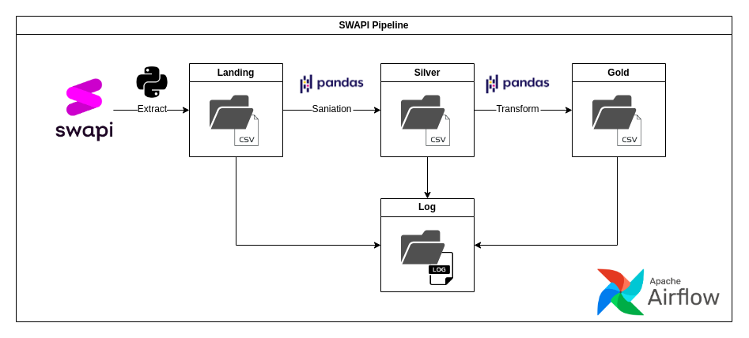

# Projeto DataOps

- [Projeto DataOps](#projeto-dataops)
  - [Introdução](#introdução)
  - [Estrutura do projeto](#estrutura-do-projeto)
    - [Extração](#extração)
  - [Origem dos dados](#origem-dos-dados)
  - [Requisitos](#requisitos)
  - [Componentes do grupo](componentes-do-grupo)

## Introdução

Projeto desenvolvido para avaliação final da disciplina DataOps oferecida no curso de MBA em Engenharia de Dados turma 03 (2023-2024), oferecido pela faculdade Impacta.

O projeto consite em obter dados da API “SWAPI — the Star Wars API” e gerar um arquivo .csv com os dados relativos a características do personagem, seu planeta natal e os filmes em que ele/ela participou.
A API SWAPI refere-se ao universo de Star Wars, maior franquia da cultura pop de todos os tempos, e traz dados relativos a Planetas, Naves Espaciais, Veículos, Pessoas (no nosso caso adotamos o conceito de Personagem), Filmes e Espécies. Todo o conteúdo do site em que a api está hospedada está em inglês, logo as bases estão em inglês sendo denominadas Planets, Spaceships, Vehicles, People, Films and Species.
Para esse projeto consumimos dados apenas das  fontes de dados Planets, People e Films, conforme descrição a seguir:

- Personagens: Os detalhes sobre os personagens da saga Star Wars podem ser obtidos na seguinte URL: https://swapi.dev/api/people/.

- Planetas: Informações sobre os planetas do universo Star Wars estão disponíveis na URL: https://swapi.dev/api/planets/.

- Filmes: Os dados relacionados aos filmes da franquia Star Wars podem ser acessados na URL: https://swapi.dev/api/films/.

## Estrutura do projeto

### Extração

  Para extração dos dados foi utilizado a biblioteca httpx, com o objetivo de realizar requisições HTTP de forma assíncrona.

## Origem dos dados

- <https://swapi.dev/api/people/>?
- <https://swapi.dev/api/planets/>?
- <https://swapi.dev/api/films/>?

## Requisitos

- Formato da tabela de entrega: csv
- Frequência de atualização do dado: frequência de 1x por dia
- Parâmetro de coleta: 1 página por dia
- Salvar logs do processo
- Armazenamento dos dados brutos
- Armazenamento dos dados saneados: Tratamento de tipos, nomes e nulos
- Armazenamento dos dados agregados e tratados
- Validação de qualidade de dados: Validação de duplicados e Tolerância de nulos
- Orquestração realizada via airflow

Os dados que serão coletados para este projeto têm origem na Star Wars API (SWAPI). 

3) Requisitos do Sistema

Para garantir o sucesso deste projeto de coleta e armazenamento de dados da SWAPI, é essencial definir requisitos claros e especificações técnicas:

Formato da tabela de entrega: Os dados coletados devem ser armazenados em formato CSV (Comma-Separated Values), um formato amplamente suportado para armazenamento de dados tabulares.

Frequência de atualização dos dados: A coleta de dados deve ocorrer com uma frequência de pelo menos uma vez por dia, garantindo que as informações estejam sempre atualizadas.

Parâmetro de coleta: A coleta de dados deve ser configurada para coletar uma página de dados por dia a partir das URLs fornecidas, permitindo uma distribuição eficiente da carga de solicitações.

Salvar logs do processo: É importante registrar e armazenar logs do processo de coleta, incluindo informações sobre quando a coleta ocorreu, se houve erros e outras informações relevantes para fins de rastreamento e auditoria.

Armazenamento dos dados brutos: Os dados brutos coletados da SWAPI devem ser armazenados sem qualquer modificação ou processamento adicional, para garantir a integridade dos dados originais.

Armazenamento dos dados saneados: Além dos dados brutos, é necessário implementar um processo de saneamento que inclua o tratamento de tipos de dados, correção de nomes, preenchimento de valores nulos e outras etapas necessárias para garantir a qualidade dos dados.

Armazenamento dos dados agregados e tratados: Os dados tratados e saneados devem ser armazenados de forma organizada e pronta para uso em análises posteriores.

Validação de qualidade de dados: Um processo de validação de qualidade de dados deve ser implementado, incluindo a identificação e tratamento de registros duplicados e a definição de tolerâncias para valores nulos.

Esses requisitos e especificações técnicas ajudarão a garantir que o projeto de coleta e armazenamento de dados da SWAPI seja bem-sucedido, com dados precisos, atualizados e de alta qualidade prontos para análises e outras aplicações.

  ## Componentes do grupo

  Gisele Souza
  Ingrid Calou
  Monise Negrão
  Pablo Batista
  Ruy Peral

